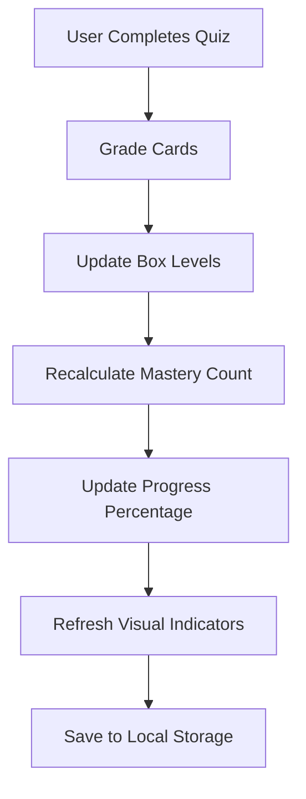

# 📊 Learning Progress System Documentation

## 📋 Overview

The Learning Progress System is a comprehensive tracking mechanism that monitors user advancement through vocabulary decks using the Leitner Box System (spaced repetition). It provides visual feedback, progress indicators, and motivational elements to enhance the learning experience.

---

## 🎯 System Architecture

### **Core Components**

1. **Progress Calculation Engine**
2. **Visual Progress Indicators**
3. **Spaced Repetition Integration**
4. **Real-time Updates**
5. **Completion Tracking**

---

## 🔢 Progress Calculation Logic

### **Mathematical Formula**

```typescript
const completionRate =
	stats.total > 0 ? Math.round((stats.mastered / stats.total) * 100) : 0;
```

### **Key Metrics**

| **Metric**          | **Description**        | **Calculation**                        |
| ------------------- | ---------------------- | -------------------------------------- |
| **Total Words**     | All words in the deck  | `deck.cardIds.length`                  |
| **Mastered Words**  | Words at box level 5   | `cards.filter(card => card.box === 5)` |
| **Due Words**       | Words ready for review | `getDueCards(deckCards)`               |
| **Completion Rate** | Mastery percentage     | `(mastered / total) × 100`             |

### **Box Level System**

The system uses a 5-box Leitner system for spaced repetition:

| **Box Level** | **Status**   | **Review Interval** | **Progress Contribution**  |
| ------------- | ------------ | ------------------- | -------------------------- |
| **Box 1**     | New/Learning | 1 day               | ❌ Not mastered            |
| **Box 2**     | Learning     | 3 days              | ❌ Not mastered            |
| **Box 3**     | Reviewing    | 7 days              | ❌ Not mastered            |
| **Box 4**     | Reviewing    | 14 days             | ❌ Not mastered            |
| **Box 5**     | **Mastered** | 30 days             | ✅ **Counted as mastered** |

---

## 🎨 Visual Progress Indicators

### **1. Progress Bar Component**

```tsx
<div className="w-full bg-slate-200 rounded-full h-3">
	<div
		className="bg-gradient-to-r from-primary via-primary/90 to-primary/80 h-3 rounded-full"
		style={{ width: `${completionRate}%` }}
	/>
</div>
```

#### **Visual Elements:**

- **Background Bar**: Light gray container showing total capacity
- **Progress Fill**: Gradient bar that fills based on completion percentage
- **Dynamic Width**: Calculated as `completionRate%` of container width
- **Smooth Animation**: 700ms ease-out transition

### **2. Statistics Cards**

#### **Total Words Card (Blue Theme)**

```tsx
<div className="bg-gradient-to-br from-blue-50 to-blue-100/50">
	<div className="text-2xl font-black text-blue-700">{stats.total}</div>
	<div className="text-xs font-semibold text-blue-600 uppercase">
		Total Words
	</div>
</div>
```

#### **Due Words Card (Orange Theme)**

```tsx
<div className="bg-gradient-to-br from-orange-50 to-orange-100/50">
	<div className="text-2xl font-black text-orange-700">{stats.due}</div>
	<div className="text-xs font-semibold text-orange-600 uppercase">
		Due Today
	</div>
</div>
```

#### **Mastered Words Card (Green Theme)**

```tsx
<div className="bg-gradient-to-br from-green-50 to-green-100/50">
	<div className="text-2xl font-black text-green-700">{stats.mastered}</div>
	<div className="text-xs font-semibold text-green-600 uppercase">Mastered</div>
</div>
```

### **3. Completion Badge**

```tsx
{
	completionRate === 100 && (
		<div className="w-4 h-4 bg-green-500 rounded-full flex items-center justify-center">
			<div className="w-2 h-2 bg-white rounded-full animate-pulse" />
		</div>
	);
}
```

**Triggers when:**

- All words in deck reach box level 5
- Completion rate equals 100%
- Shows animated green badge with pulsing indicator

---

## 🔄 Real-Time Updates

### **Update Triggers**

The progress system updates automatically when:

1. **Quiz Session Completion**

   ```typescript
   // After each quiz session
   const updatedCards = gradeCard(card, grade);
   updateProgress(deckId, updatedCards);
   ```

2. **Word Box Advancement**

   ```typescript
   // When word moves to higher box
   if (newBox > card.box) {
   	updateMasteryCount(deckId);
   }
   ```

3. **New Words Added**
   ```typescript
   // When new words are added to deck
   const newTotal = deck.cardIds.length;
   recalculateProgress(deckId, newTotal);
   ```

### **Update Process**



---

## 📈 Progress States

### **Progress Ranges & Visual Feedback**

| **Range**  | **Status**      | **Visual State**            | **Motivational Message**      |
| ---------- | --------------- | --------------------------- | ----------------------------- |
| **0-25%**  | Just Started    | Empty bar, basic colors     | "Begin your learning journey" |
| **26-50%** | Making Progress | Quarter to half filled      | "Great progress! Keep going"  |
| **51-75%** | Almost There    | Mostly filled bar           | "You're doing amazing!"       |
| **76-99%** | Nearly Complete | Almost full bar             | "So close to mastery!"        |
| **100%**   | Fully Mastered  | Full bar + completion badge | "🎉 Deck Mastered!"           |

### **Color Psychology**

- **Blue (Total)**: Trust, stability, foundation
- **Orange (Due)**: Energy, urgency, action needed
- **Green (Mastered)**: Success, achievement, growth
- **Primary (Progress)**: Focus, determination, progress

---

## 🎯 User Experience Features

### **1. Motivational Elements**

#### **Progress Labels**

```tsx
<div className="flex items-center justify-between text-xs">
	<span>Started</span>
	<span className="font-medium">
		{stats.mastered} of {stats.total} mastered
	</span>
	<span>Complete</span>
</div>
```

#### **Animated Indicators**

- **Pulsing Dots**: Small animated indicators on each stat card
- **Shimmer Effect**: Animated shimmer on progress bar
- **Hover Animations**: Enhanced effects on card hover

### **2. Interactive Feedback**

#### **Hover Effects**

```css
.group-deck:hover {
	transform: scale(1.02);
	box-shadow: 0 20px 25px -5px rgba(0, 0, 0, 0.1);
}
```

#### **Smooth Transitions**

- **Color Changes**: 300ms duration
- **Scale Animations**: 300ms duration
- **Progress Bar**: 700ms ease-out
- **Shadow Effects**: 300ms duration

---

## 🔧 Technical Implementation

### **Data Flow**

```typescript
// 1. Get deck statistics
const getDeckStats = (deck: Deck) => {
	const deckCards = cards.filter((card) => deck.cardIds.includes(card.id));
	const dueCards = getDueCards(deckCards);
	const masteredCards = deckCards.filter((card) => card.box === 5);

	return {
		total: deckCards.length,
		due: dueCards.length,
		mastered: masteredCards.length,
	};
};

// 2. Calculate completion rate
const completionRate =
	stats.total > 0 ? Math.round((stats.mastered / stats.total) * 100) : 0;

// 3. Update visual indicators
const progressWidth = `${completionRate}%`;
```

### **Storage Integration**

```typescript
// Local storage operations
const updateProgress = (deckId: string, updatedCards: Card[]) => {
	const deck = getDeck(deckId);
	const newStats = getDeckStats(deck);

	// Update local storage
	setDecks(updatedDecks);

	// Trigger UI update
	setDecksState(updatedDecks);
};
```

---

## 📊 Performance Considerations

### **Optimization Strategies**

1. **Debounced Updates**: Prevent excessive recalculations
2. **Memoized Calculations**: Cache expensive operations
3. **Efficient Rendering**: Only update changed components
4. **Smooth Animations**: Use CSS transforms for performance

### **Memory Management**

```typescript
// Clean up animations on unmount
useEffect(() => {
	return () => {
		// Cleanup animation timers
		clearTimeout(animationTimer);
	};
}, []);
```

---

## 🎨 Customization Options

### **Theme Variations**

#### **Light Theme**

- Subtle gradients and soft shadows
- High contrast text
- Gentle hover effects

#### **Dark Theme**

- Darker gradient backgrounds
- Bright accent colors
- Enhanced glow effects

### **Accessibility Features**

- **Screen Reader Support**: Proper ARIA labels
- **Keyboard Navigation**: Focus indicators
- **Color Contrast**: WCAG 2.1 AA compliant
- **Reduced Motion**: Respects user preferences

---

## 🚀 Future Enhancements

### **Planned Features**

1. **Streak Tracking**: Daily learning streaks
2. **Achievement Badges**: Milestone celebrations
3. **Progress Analytics**: Detailed learning insights
4. **Social Sharing**: Progress sharing capabilities
5. **Gamification**: Points and leaderboards

### **Advanced Metrics**

- **Learning Velocity**: Words mastered per day
- **Retention Rate**: Long-term memory retention
- **Difficulty Analysis**: Problem word identification
- **Optimal Review Times**: AI-powered scheduling

---

## 📝 Usage Examples

### **Basic Implementation**

```tsx
// Get deck statistics
const stats = getDeckStats(deck);
const completionRate = Math.round((stats.mastered / stats.total) * 100);

// Render progress bar
<ProgressBar
	value={completionRate}
	max={100}
	showPercentage={true}
	animated={true}
/>;
```

### **Advanced Customization**

```tsx
// Custom progress component
<LearningProgress
	deck={deck}
	showDetails={true}
	animated={true}
	theme="modern"
	onComplete={(deckId) => showCelebration(deckId)}
/>
```

---

## 🔍 Troubleshooting

### **Common Issues**

1. **Progress Not Updating**

   - Check if cards are properly linked to deck
   - Verify box level calculations
   - Ensure local storage is working

2. **Visual Glitches**

   - Clear browser cache
   - Check CSS animations
   - Verify component re-renders

3. **Performance Issues**
   - Reduce animation complexity
   - Implement debouncing
   - Optimize re-render cycles

---

## 📚 Related Documentation

- [Spaced Repetition System](./SPACED_REPETITION_SYSTEM.md)
- [Quiz Components](./QUIZ_COMPONENTS.md)
- [Data Storage](./DATA_STORAGE.md)
- [Visual Design System](./VISUAL_DESIGN_SYSTEM.md)

---

_This documentation provides a comprehensive guide to understanding and implementing the Learning Progress System in the Arabic-Bangla Flashcard Quiz application._
